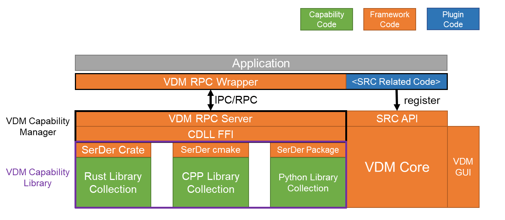

# Virtual Domain Manager


https://user-images.githubusercontent.com/9068301/171314911-ac6e9794-105d-409d-98da-9222b7dc53b5.mp4


## Introduction
[中文简介 - deepin论坛](https://bbs.deepin.org/zh/post/219493)
<!-- How to take a snapshot of a running operating system, and somehow restore from it?

- **Plan A**: request status of *hardwares* (CPU, Memory, Storage) and record them all.
- **Plan B**: request status of *softwares* (users' applications) and record them all.

As "Plan A" is straightforward (e.g., virtual machine) but always with high overhead, we believe "Plan B" (e.g., [CRIU](https://github.com/checkpoint-restore/criu)) is the future.

This project, VDM, is a non-serious-but-effective "Plan B" design. Focusing on the running status of all your GUI applications on **multiple-desktop / multiple-screen / multiple-device**, VDM would like to arrange them according to your **working domain** definition.

In the open working domain, VDM would request all the support applications to report their necessary running status (open files, window status and etc.), record them for future restore. Unfortunately, while there are no such status-report APIs, VDM proposes a **plugin mechanism** to implement such support and provides **capability library** to simplify the development.-->

<p align="center">
  
</p>

> Currently, we are seeking for help on: plugin development, capability library contribution, and any suggestions. If you want to join the maintainer team, please [contact me](mailto:sudofree_at_163_com). 

## Installation

1. **clone this repository**

   ```bash
   git clone https://github.com/VDM-Maintainer-Group/virtual-domain-manager.git --depth=1
   git submodule update --init
   ```

2. **build with cmake** (>=3.10)

   ```bash
   mkdir build; cd build; cmake ..; make
   ```

3. **build and install pyvdm**

   ```bash
   cd build; make build-pyvdm
   cd dist; pip3 install *.whl
   ```

4. **build and install capability library**

    ```bash
    cd capability; sbs build; sbs install
    ```

## Usage for Command Line

> Currently, the VDM main program is `pyvdm`, the GUI entry is a tray icon `pyvdm-tray`.

- **Workload Manipulation**

  `pyvdm --open <domain-name>` to open an existing domain;

  `pyvdm --save` to save current domain;

  `pyvdm --close` to close current domain;

  Or, you can easily apply above operations via `pyvdm-tray` on your dock.

- **Plugin Management** `pyvdm plugin`

  - `install` a plugin with the "*.zip" file
  - `uninstall` existing plugin(s) with `name(s)`
  - `list` plugin details (list all by default)
  - `run` plugin functions with:

    `pyvdm plugin run <plugin-name> <function-name>`

- **Domain Management** `pyvdm domain`

  - `add` a domain via TUI with `name`
  - `update` an existing domain with `name`
  - `remove` an existing domain with `name`
  - `list` domain details (list all by default)

- **Capability Management** `pyvdm capability`

  - `install` capability from folder or "*.zip" file
  - `uninstall` capability with `name`
  - `enable`/`disable`/`query` capability status
  - capability daemon status:

    `pyvdm capability daemon start/stop/restart/status`

- **Sync Management** `pyvdm sync`

  > Manage synchronization of domain status files.

  (To be updated ...)

## Capability Development

Please refer to the guidance [here](https://github.com/VDM-Maintainer-Group/vdm-capability-library/blob/main/CONTRIBUTING.md).

## Plugin Development

Please refer to the guidance [here](https://github.com/VDM-Maintainer-Group/vdm-plugin-template/blob/master/CONTRIBUTING.md).

## License

Virtual Domain Manager is licensed under [GPLv3](LICENSE).
