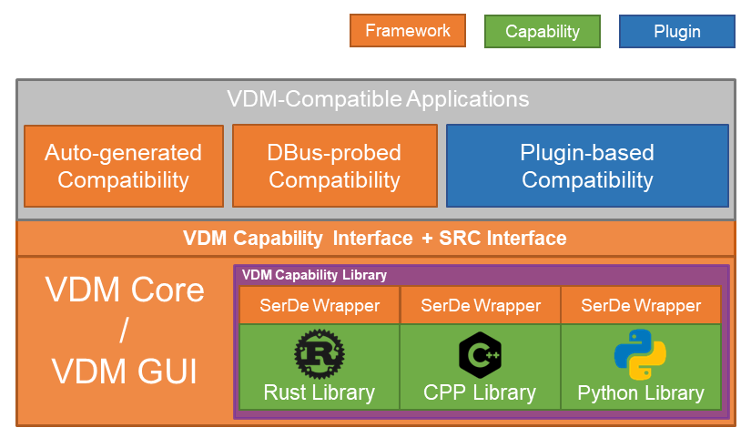

# Virtual Domain Manager

Virtual Domain Manager (VDM) is for fast arranging your workloads, *archive, restore and synchronize (ARS)*.

## Introduction

VDM embraces both concept ***work-space*** and ***screen-space***, where the workloads are placed on the *virtual workspace (desktop)* and *multiple screens* on your computer, respectively.
VDM aims at recognize the **position** and **contents** of those applications, and allows you archive them and restore them later, exactly in the same status you would like to see!

Unfortunately, while there are no system-side mechanism/regulation to *recognize the contents* of variety of applications (though Windows10 is trying hard on its [UWP Restore](https://support.microsoft.com/en-us/help/4230676/windows-10-get-help-with-timeline)), VDM is now dedicated developed on GNU/Linux platform and highly coupled with Linux kernel.

VDM basically only provides a framework with *ARS interface* with some utility functions, and relies on OUR efforts to implement the application-dependent *ARS functions*.

So, more plugins, more fun!

## (In-Refactoring)

> **Dependencies**
> 
> Python 3.7+
> **Installation**
> 
> 1. (optional) configure default `config.json`
> 2. `make check && make install`
> 
> **Usage**
> 
> (Not available now)
> 
> **Plugin Development**
> 
> Please refer to the tutorial [here](plugin-template/README.md).

## License

Virtual Domain Manager is licensed under [GPLv3](LICENSE).
